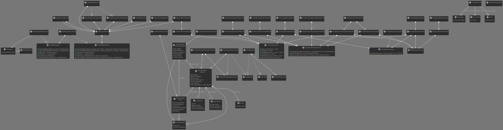

# mealmate

[![Forks][forks-shield]][forks-url]
[![Stargazers][stars-shield]][stars-url]
[![Issues][issues-shield]][issues-url]
[![MIT License][license-shield]][license-url]
[![LinkedIn][linkedin-shield]][linkedin-url]

<!-- PROJECT LOGO -->
 

  

<!-- TABLE OF CONTENTS -->

  
Table of Contents

  <ol>
    <li>
      <a href="#about-the-project">About The Project</a>
      <ul>
        <li><a href="#built-with">Built With</a></li>
      </ul>
    </li>
    <li>
      <a href="#introduction">Introduction</a>
      <ul>
        <li><a href="#what-is-mealmate">What is MealMate?</a></li>
        <li><a href="#how-do-i-use-mealmate">How do I use MealMate?</a></li>
      </ul>
    </li>
    <li><a href="#uml-modeling">Uml Modeling</a></li>
    <li><a href="#contact">Contact</a></li>
    <li><a href="#license">License</a></li>
    <li><a href="#acknowledgments">Acknowledgments</a></li>
  </ol>

(<a href="#top">back to top</a>)

<!-- ABOUT THE PROJECT -->
## About The Project

This project is primarily used to showcase one's skills. It was created for the subject Android Programming with Kotlin at the OTH Regensburg and has no commercial background.
The teaching professor was <a href="https://github.com/ddrohan">Dave Drohan.

(<a href="#top">back to top</a>)

### Built With

* [Android](https://developer.android.com/)
* [Kotlin](https://kotlinlang.org/)
* [Dagger](https://dagger.dev/)
* [Material Design 3](https://m3.material.io/)
* [Firebase](https://firebase.google.com/)
* [TheMealDB](https://www.themealdb.com/)
* [Ktlint](https://github.com/JLLeitschuh/ktlint-gradle)
* [Retrofit](https://square.github.io/retrofit/)
* [Planuml](https://plantuml.com/en/)

(<a href="#top">back to top</a>)

## Introduction

<!-- GETTING STARTED -->
### What is MealMate?

Mealmate is a recipe app designed to help users plan, prepare and enjoy delicious meals at home. With an extensive database of recipes, users can search for meal ideas based on ingredients, dietary restrictions, and cooking time. The app offers step-by-step instructions and a detailed list of ingredients for each recipe, making it easy for users to follow along. Mealmate also includes features such as a meal planning calendar, a shopping list generator, and the ability to save and organize favorite recipes. Whether you're a beginner cook or a seasoned pro, Mealmate is the perfect companion for creating delicious meals at home.

### How do I use MealMate?

To use Mealmate, first, download the app.

Once you have the app installed, create an account or sign in if you already have one.
To search for a recipe, use the search bar at the top of the screen and enter as keyword the recipe name. You can also browse recipes by category, such as breakfast, lunch, dinner, or dessert, or areas like american.
When you find a recipe that you want to make, tap on it to view the instructions and ingredient list. You can also view the recipe's rating and difficulty level.
If you want to edit a recipe of other creator you can do so, but just by using it as a bluepause.
Finally, you can also evaluate your favorite recipes and track the ratings of othersin the evaluation page.

Enjoy your cooking with Mealmate!
    
## UML Modeling

The following UML-Diagram class diagram tries to describe the different types of objects within a system and the types of static relationships that exist between them. It also illustrates the operations and attributes of the classes.  

    
<!-- LICENSE -->
## License

Distributed under the MIT License. See `LICENSE.txt` for more information.

(<a href="#top">back to top</a>)

<!-- CONTACT -->
## Contact

David Schmidt - [Instagram]: @[_life_of_david](https://www.instagram.com/_life_of_david/)

David Schmidt - [LinkedIn]: @[David Schmidt](https://www.linkedin.com/in/david-schmidt-09b69b1b6)

Project Link: [Asteo] (https://github.com/users/KonsumGandalf/projects/6)
    
<!-- ACKNOWLEDGMENTS -->
## Acknowledgments

Sources that helped me to improve the Project

* [Dave Drohan](https://github.com/ddrohan)
* [Stevdza-San](https://www.youtube.com/@StevdzaSan)
* [Philipp Lackner](https://www.youtube.com/@PhilippLackner)
* [Golnaz Torabi](https://levelup.gitconnected.com/clean-architecture-with-mvvm-34cc05ab3bc5)
* [Android-Conventions](https://github.com/ribot/android-guidelines)
* [Philipp Lackner](https://www.youtube.com/@PhilippLackner)
* [ReadMe Template](https://github.com/othneildrew/Best-README-Template)
* [Choose an Open Source License](https://choosealicense.com)

(<a href="#top">back to top</a>)

<!-- MARKDOWN LINKS & IMAGES -->
<!-- https://www.markdownguide.org/basic-syntax/#reference-style-links -->
[forks-shield]: https://img.shields.io/github/forks/KonsumGandalf/MealMate?style=for-the-badge
[forks-url]:https://github.com/KonsumGandalf/MealMate
[stars-shield]: https://img.shields.io/github/stars/KonsumGandalf/MealMate?style=for-the-badge
[stars-url]: https://github.com/KonsumGandalf/MealMate
[issues-shield]: https://img.shields.io/github/issues/KonsumGandalf/MealMate?style=for-the-badge
[issues-url]: https://github.com/KonsumGandalf/MealMate/issues
[license-shield]: https://img.shields.io/github/license/othneildrew/Best-README-Template.svg?style=for-the-badge
[license-url]: https://github.com/othneildrew/Best-README-Template/blob/master/LICENSE.txt
[linkedin-shield]: https://img.shields.io/badge/-LinkedIn-black.svg?style=for-the-badge&logo=linkedin&colorB=555
[linkedin-url]: https://www.linkedin.com/in/david-schmidt-09b69b1b6/
